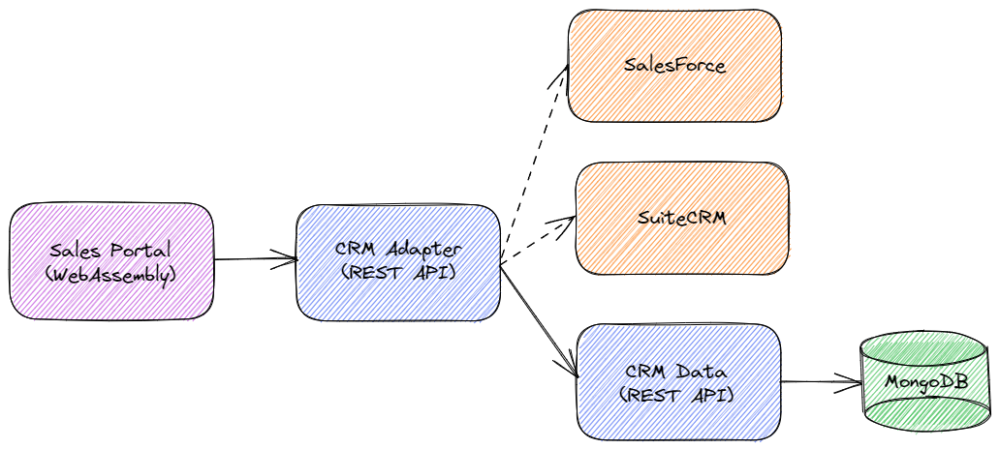

# Sales Portal

[](https://github.com/devpro/sales-portal/actions/workflows/ci.yaml)
[](https://github.com/devpro/sales-portal/actions/workflows/pkg.yaml)
[](https://sonarcloud.io/summary/new_code?id=devpro.salesportal)
[](https://hub.docker.com/r/devprofr/salesportal-wasmapp)

Open source solution for a Sales Portal. It has been created for educational purposes but feel free to use it and contribute!

## Design



## Installation

[Helm](https://helm.sh) must be installed to use the charts. Once correctly setup, add the repository:

```bash
helm repo add devpro https://devpro.github.io/helm-charts
```

If you had already added this repo earlier, run `helm repo update` to retrieve the latest versions of the packages. To install the chart:

```bash
helm upgrade --install sales-portal devpro/sales-portal --create-namespace --namespace sales-portal
```

## Development

Look at [the contributing guide](CONTRIBUTING.md).
